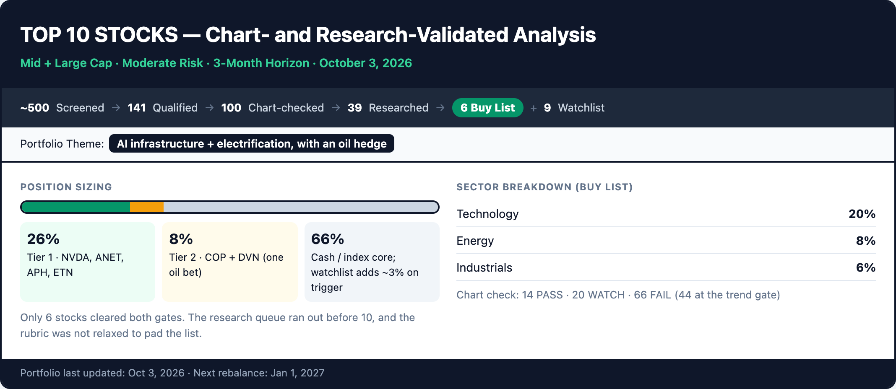
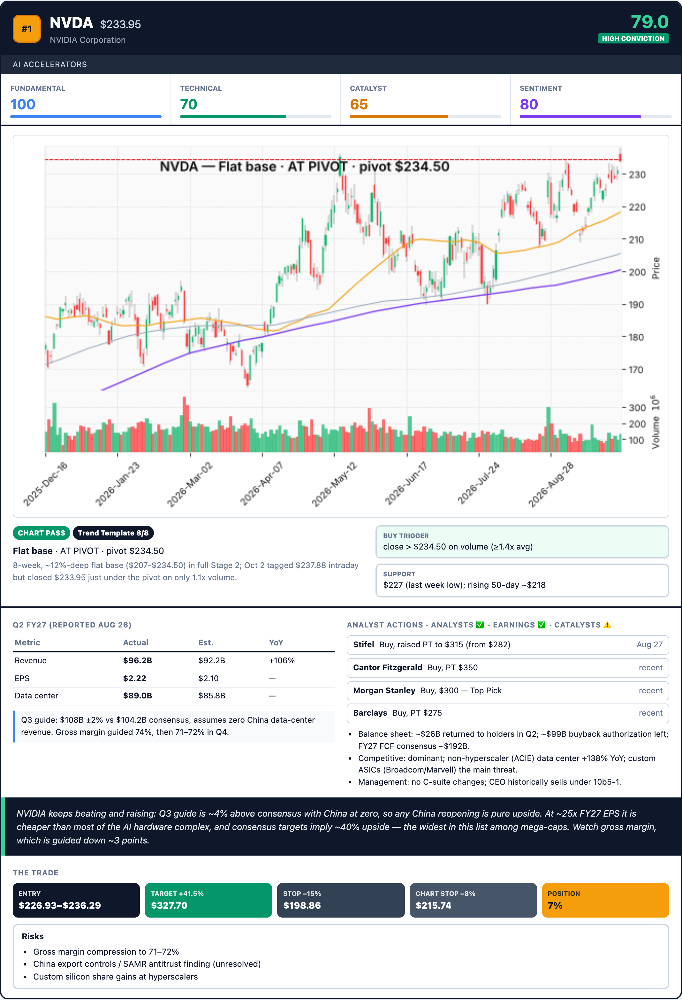
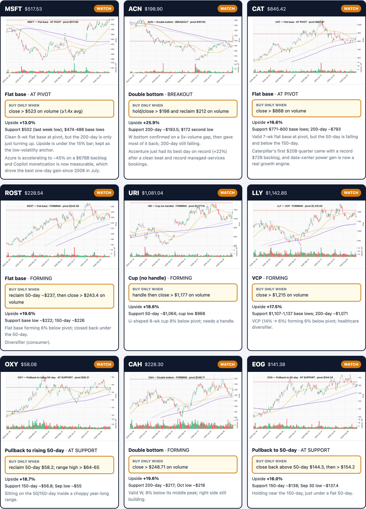
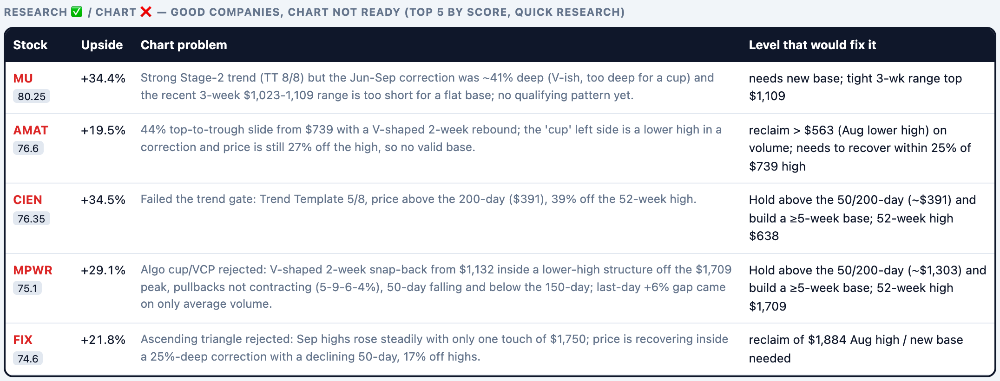

# stock-screener-2

**Chart-first, research-validated stock screener for US mid- and large-cap stocks.**

`stock-screener-2` is version 2 of the original [`stock-screener`](../stock-screener/) skill. It keeps v1's quantitative screen and tiered web-research method. On top of that, it adds a **chart-pattern validation** step, runs that step **before** research, and shows **each stock's chart** in the final report.

> ⚠️ For educational purposes only. Not financial advice.

---

## Example report

Screenshots from [`EXAMPLE_TOP_10_STOCKS_2026-10-03.html`](EXAMPLE_TOP_10_STOCKS_2026-10-03.html), a real run from October 3, 2026 (Oct 2 closing prices). Open the HTML file in a browser to see the full report.

**Overview:** the funnel from ~500 screened stocks to the Buy list, plus position sizing and sector mix.



**Buy-list card:** each stock gets its chart with the verified pivot, the chart verdict and buy trigger, earnings and analyst research, and trade levels.



**Watchlist:** stocks that passed research but whose chart is still forming, each with a "buy only when…" trigger.



**Disqualified (Research ✅ / Chart ❌):** good companies whose charts aren't ready, with the level that would fix each one.



---

## What's new in v2

| Area | v1 (`stock-screener`) | v2 (`stock-screener-2`) |
|---|---|---|
| Phases | 2: quant screen → web research | 3: quant screen → **chart validation** → web research |
| Chart check | None (only the technical sub-score in the quant model) | Minervini Trend Template + O'Neil/Bulkowski bullish patterns, algorithmic pre-scan **plus a required visual check** |
| Research scope | Fixed top 15 by score | Only chart-qualified names, in score order, stopping once 10 stocks pass both gates |
| Screening depth | Top 15 | Top 50 chart-scanned; extends 50 at a time (`--skip 50`) when needed |
| Output lists | Top 10 | **Buy list** (chart ✅ + research ✅), **Watchlist** (research ✅, chart forming; buy on trigger), and a **Research ✅ / Chart ❌** table |
| Trade levels | Entry, target, −15% stop | Adds a **pivot / buy zone**, a **buy trigger**, and a **chart stop** (pivot × 0.92) |
| Report | Text and tables | **Chart image for every Buy-list and Watchlist stock**: linked in the `.md`, embedded as base64 in the `.html` |
| New script | — | `chart_patterns.py` (pre-scan and final report charts) |

### Why chart-first?

A stock has to pass both gates, so running the chart check first doesn't change the final list. What it changes is cost. The chart check takes seconds per stock; research takes minutes. Checking charts first means no research time is spent on stocks that can't qualify, and the screen can reach well past the top 15.

---

## How it works

```
Phase 1  Quant screen (Python)        S&P 500 → ranked CSV of stocks scoring ≥60
   │
Phase 2  Chart validation             Top 50 → script pre-scan → visual check → PASS / WATCH / FAIL
   │
Phase 3  Research (web)               PASS, then WATCH, in score order → Tier 1 + Tier 2 → stop at 10 buys
   │
Report   Buy list + Watchlist, each with its chart, rationale and trade levels (.md + .html)
```

### Phase 1: Quantitative screen (unchanged from v1)
`run_real_screening.py` scores about 500 stocks on four components: Fundamental 30%, Technical 25%, Catalyst 30%, Sentiment 15%. Every stock scoring ≥60 is saved to `screening_results_{timestamp}.csv`. That CSV feeds Phase 2 and is the **single source of truth for price**.

### Phase 2: Chart validation (new)

**Step 1, trend gate: Minervini Trend Template (8 criteria)**
1. Price > 150-day and 200-day moving averages
2. 150-day > 200-day
3. 200-day rising for at least 1 month
4. 50-day > 150-day and 200-day
5. Price > 50-day
6. Price ≥ 30% above its 52-week low
7. Price within 25% of its 52-week high
8. Relative strength beats the S&P 500 (weighted 3/6/9/12-month return minus SPY's)

Stage 2 means a score of ≥6/8, with price above the 200-day and the 50-day above the 200-day. A downtrend fails, unless the stock has a confirmed reversal (for example, a W bottom that has broken out) and is back above its 200-day.

**Step 2: a valid bullish pattern** (from O'Neil/IBD and Bulkowski)

| Pattern | Rule | Pivot |
|---|---|---|
| Flat base | ≥5 weeks, ≤15% deep | Top of range |
| Cup with handle | ≥7 weeks, U-shaped, 12–35% deep; handle ≤12% in the upper half | Handle high |
| Double bottom | Lows within ~5%, ≥3 weeks apart | Middle peak |
| Ascending triangle | Flat highs, rising lows | Flat top |
| Bull / high-tight flag | Pole ≥20% (≥90% for a high-tight flag), then a tight shallow pullback | Flag high |
| VCP | 2–3 shrinking pullbacks, the last ≤10%, volume drying up | Last swing high |
| Pullback to 50-day | Orderly, light-volume dip to a rising 50-day | 50-day (support) |

**Step 3: status vs. the pivot**
`BREAKOUT` (above the pivot on ≥1.4× volume, no more than 5% past it) · `AT PIVOT` (within 5% below) · `AT SUPPORT` · `FORMING` (5–10% below) · `EXTENDED` (>5% above, don't chase) · `FAILED`

**Verdict**
- ✅ **PASS**: Stage 2 + a valid pattern at BREAKOUT, AT PIVOT or AT SUPPORT
- ⚠️ **WATCH**: a valid pattern that is FORMING or EXTENDED, or a near-miss on the trend
- ❌ **FAIL**: no valid pattern, a downtrend, a failed breakout, or a V-shaped/sloppy structure

**The algorithm proposes; a human-style visual check decides.** In testing, the script flagged false positives: V-shaped rebounds labelled as cups, double bottoms with lows only days apart, and "flat bases" that were really lower highs. Every chart is therefore inspected against the rubric before it gets a verdict.

### Phase 3: Research (v1 method, narrower scope)
Same tiered method as v1:
- **Tier 1:** analyst actions, earnings, catalysts. Must pass 2 of 3.
- **Tier 2:** balance sheet, competitive position, management, red flags. Any critical red flag disqualifies.
- **Upside rule:** implied upside from mid-entry must be ≥15%.

Only the Phase 2 research queue is researched, in final-score order, stopping at 10 Buy-list stocks.

### Report
- Each **Buy-list** stock: chart, researched rationale, chart verdict (pattern, status, pivot, trigger, support), and trade levels (entry, target, −15% stop, chart stop).
- Each **Watchlist** stock: chart and its exact "buy only when…" trigger.
- Both `.md` and a self-contained `.html` (charts embedded) are produced.

---

## Usage

Ask Claude something like *"find stocks I should buy, chart-validated"*, or invoke the skill by name. Claude asks for market cap, sectors, risk tolerance and time horizon, then runs all three phases.

### `chart_patterns.py` commands

```bash
# Pre-scan the top 50 from the Phase 1 CSV
python chart_patterns.py --csv screening_results_{ts}.csv --top 50 \
  --out chart_patterns_{ts}.json --charts charts_{ts}

# Extend the scan to the next 50
python chart_patterns.py --csv screening_results_{ts}.csv --skip 50 --top 50 \
  --out chart_patterns_{ts}_2.json --charts charts_{ts}

# Scan specific tickers
python chart_patterns.py --tickers NVDA,ANET --out patterns.json --charts charts_dir

# Render report charts using the VERIFIED pivots (leave the pivot blank for support setups)
python chart_patterns.py --final "NVDA=234.50:Flat base,ANET=212:Cup with handle,COP=:Pullback to rising 50-day" \
  --charts charts_{ts}
```

Dependencies: `yfinance pandas numpy mplfinance`

---

## Outputs (saved to `~/Desktop/`, timestamped)

| File | Contents |
|---|---|
| `screening_results_{ts}.csv` | All Phase 1 qualifiers (≥60), with price |
| `chart_patterns_{ts}.json` | Script pre-scan: Trend Template, candidate patterns, pivots |
| `charts_{ts}/{TICKER}.png` | Scan chart: 1 year, 50/150/200-day averages, volume, proposed pivots |
| `charts_{ts}/{TICKER}_final.png` | Report chart with the verified pivot |
| `TOP_10_STOCKS_{ts}.md` | Final report with linked charts |
| `TOP_10_STOCKS_{ts}.html` | Self-contained HTML report with embedded charts |

---

## File layout and dependencies on v1

```
~/.claude/skills/
├── stock-screener/            # v1, unchanged; supplies the Phase 1 scripts
│   ├── run_real_screening.py
│   ├── stock_screener.py
│   ├── universe_fetcher.py
│   ├── requirements.txt
│   └── venv/
└── stock-screener-2/          # v2
    ├── SKILL.md
    ├── README.md
    └── chart_patterns.py      # full source is also embedded in SKILL.md
```

v2 reuses v1's Phase 1 scripts rather than duplicating them, so **keep `stock-screener` installed**.

---

## Timing (approx., full S&P 500)

| Phase | Time |
|---|---|
| 1. Quant screen | 15–17 min |
| 2. Chart validation (top 50) | 10–15 min |
| 3. Research | 30–45 min |
| **Total** | **~55–77 min** |

---

## Sources for the chart rubric
- Mark Minervini, *Trade Like a Stock Market Wizard*: Trend Template, VCP
- William J. O'Neil, *How to Make Money in Stocks* / IBD: base patterns, pivots, the 7–8% stop rule
- Thomas Bulkowski, *Encyclopedia of Chart Patterns*: pattern definitions and statistics

## Limitations
- Chart patterns improve the odds; they don't guarantee outcomes. Breakouts fail, so honor the stops.
- Each run is a point-in-time snapshot. WATCH names can turn into PASS, and PASS names can fail.
- The visual check involves judgment. The written rubric keeps it consistent, but borderline charts can be read differently.
- The overall market direction isn't modeled. In a broad sell-off, most breakouts fail.
- Uses free data (Yahoo Finance and web search), which may be delayed or incomplete.
